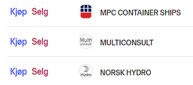
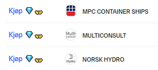

# Stonks only go up

An chrome extension that removes the sell button on Nordnet. Why? Since stonks only go up!

Only works on Nordnet.no due to whitelisting of domain name.

### Installation

Needs to be installed manually for now.

* Clone the repo locally to somewhere on your computer.
* Open Chrome and go to `chrome://extensions/`.
* Enable `Developer mode` using the toggle switch at the top right.
* Click `Load unpacked` and navigate to the place where you saved the repo, and select the folder `extension`.
* ???
* Profit

### Images

It should go from looking like this:

To look like this:

